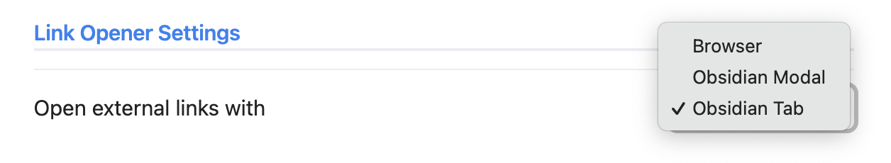

# Obsidian Link Opener

A simple [Obsidian](https://obsidian.md/) plugin to allow customized choices of where to open an external link.

## Usage

In settings, select which method you would like to open an external link with.

## Demo

Opening an external link with Obsidian Modal:

